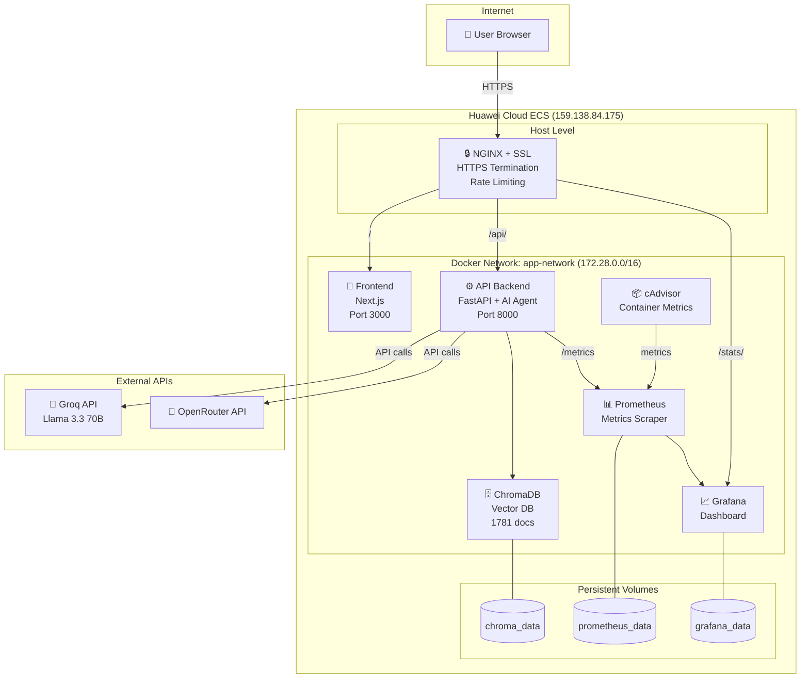

# CSE 363 Cloud Computing — Project Requirements Analysis
## Language Learning Agent: Full Compliance Report

---

## Project Overview

**Title:** Intelligent Multi-Model AI Agent for Interactive Language Learning

**Description:** A cloud-based multi-container web application that uses AI models (Llama 3 via Groq/OpenRouter) to provide interactive English language tutoring. Users can practice grammar, vocabulary, translation, quizzes, and conversation through a modern web UI. The system includes a vector database (ChromaDB) for RAG-based retrieval, OCR for image-to-text, speech-to-text (Whisper), text-to-speech, and automated email reporting.

**Problem Solved:** Language learners lack access to personalized, interactive AI tutors. This platform provides instant grammar correction, vocabulary building, translation, and quiz generation — all powered by LLMs with context from a curated knowledge base.

**Target Users:** English language learners, students, and educators.

---

## Requirement 1: Compute Layer ✅ FULLY MET

> *"At least three services must run in separate isolated environments and be managed together."*

### Evidence: 7 Isolated Containers

The project runs **7 separate Docker containers**, each in its own isolated environment:

| # | Service | Container Name | Image | Role |
|---|---------|---------------|-------|------|
| 1 | **API Backend** | `ai-backend` | Custom (Dockerfile.backend) | FastAPI server, AI agent, OCR, TTS, STT |
| 2 | **Frontend** | `ai-frontend` | Custom (Dockerfile.frontend) | Next.js web UI |
| 3 | **ChromaDB** | `chromadb` | `chromadb/chroma:latest` | Vector database for RAG |
| 4 | **NGINX** | Host-level systemd | `nginx` (system) | Reverse proxy, HTTPS termination, rate limiting |
| 5 | **Prometheus** | `ai-prometheus` | `prom/prometheus:latest` | Metrics collection |
| 6 | **Grafana** | `ai-grafana` | `grafana/grafana:latest` | Live monitoring dashboard |
| 7 | **cAdvisor** | `ai-cadvisor` | `gcr.io/cadvisor/cadvisor` | Container metrics exporter |

### Isolation Mechanism: Docker Containers

**Why containers were chosen over VMs:**
- **Lightweight:** Containers share the host OS kernel, consuming far less RAM (~50-500MB each vs ~1-4GB per VM)
- **Fast startup:** Containers start in seconds vs. minutes for VMs
- **Portability:** Docker images work identically on dev machines, CI/CD, and cloud ECS
- **Orchestration:** Docker Compose manages all 7 services with a single `docker-compose up -d` command

**Key files:**
- [docker-compose.yml](file:///c:/Users/Dell/.gemini/antigravity/scratch/lang_learning_agent/docker-compose.yml) — defines all 7 services
- [Dockerfile.backend](file:///c:/Users/Dell/.gemini/antigravity/scratch/lang_learning_agent/Dockerfile.backend) — multi-stage build (builder + runtime)
- [Dockerfile.frontend](file:///c:/Users/Dell/.gemini/antigravity/scratch/lang_learning_agent/Dockerfile.frontend) — 3-stage build (deps → build → runtime)

**Cloud concept demonstrated:** *Virtualization via OS-level containerization* — each container has its own filesystem, process space, and network namespace, providing isolation without the overhead of full virtual machines.

---

## Requirement 2: Network Virtualization ✅ FULLY MET

> *"Services must communicate using hostnames or service names, not hardcoded IP addresses."*

### Evidence: Custom Bridge Network with DNS

All containers are connected to a **custom bridge network** with a defined subnet:

```yaml
# docker-compose.yml (lines 186-191)
networks:
  app-network:
    driver: bridge
    ipam:
      config:
        - subnet: 172.28.0.0/16
```

### Hostname-Based Communication (No Hardcoded IPs)

| Source | Destination | Hostname Used | File |
|--------|-------------|---------------|------|
| NGINX | Backend | `api-backend:8000` | nginx.conf line 9 |
| NGINX | Frontend | `frontend-ui:3000` | nginx.conf line 13 |
| NGINX | Grafana | `grafana:3001` | nginx.conf line 72 |
| Prometheus | cAdvisor | `cadvisor:8080` | prometheus.yml line 19 |
| Frontend | Backend | Via NGINX reverse proxy (path `/api/`) | page.tsx |

### Network Isolation

- **External access:** Only NGINX (port 80/443) and Grafana (port 3001) expose ports to the host
- **Internal only:** The backend (`8000`), ChromaDB (`8000`), Prometheus (`9090`), and cAdvisor (`8080`) are **not exposed** to the internet — they communicate only through the internal `app-network`
- **Rate limiting:** NGINX enforces 30 requests/second per IP via `limit_req_zone`

**Cloud concept demonstrated:** *Software-Defined Networking (SDN)* — Docker's bridge network driver creates an isolated virtual network with built-in DNS resolution, analogous to a Virtual Private Cloud (VPC) in AWS/Azure/Huawei Cloud.

---

## Requirement 3: Data Persistence ✅ FULLY MET

> *"Application data must survive service restarts."*

### Evidence: 3 Named Docker Volumes

```yaml
# docker-compose.yml (lines 194-200)
volumes:
  chroma_data:    # Vector database documents (1,781 learning documents)
    driver: local
  prometheus_data: # Time-series metrics history
    driver: local
  grafana_data:    # Dashboard configurations
    driver: local
```

### Volume Mounts

| Volume | Mounted To | Purpose |
|--------|-----------|---------|
| `chroma_data` | `/app/data/chroma_db` (backend) + `/chroma/chroma` (ChromaDB) | 1,781 grammar/vocabulary/phrase documents persist across restarts |
| `prometheus_data` | `/prometheus` | Metrics history survives container recreation |
| `grafana_data` | `/var/lib/grafana` | Dashboard configs, data sources persist |

### Demo Proof
You can demonstrate persistence by:
```bash
docker stop ai-backend && docker start ai-backend
# The 1,781 documents are still loaded (shown in the UI: "✅ 1781 documents loaded")
```

**Cloud concept demonstrated:** *Persistent Storage / Block Storage* — Docker named volumes are analogous to cloud block storage (like Huawei EVS or AWS EBS). They exist independently of the container lifecycle, ensuring data durability.

---

## Requirement 4: Resource Management ✅ FULLY MET

> *"At least two services must have explicit resource boundaries configured."*

### Evidence: ALL 7 Services Have Resource Limits

| Service | CPU Limit | Memory Limit | CPU Reserved | Memory Reserved |
|---------|-----------|-------------|-------------|-----------------|
| **api-backend** | 2.0 cores | 5 GB | 1.0 cores | 2560 MB |
| **frontend-ui** | 1.0 cores | 2 GB | 0.5 cores | 512 MB |
| **chroma-db** | 2.0 cores | 5 GB | 0.5 cores | 1 GB |
| **nginx-proxy** | 0.5 cores | 256 MB | — | — |
| **prometheus** | 0.5 cores | 512 MB | — | — |
| **grafana** | 0.5 cores | 512 MB | — | — |
| **cadvisor** | 0.5 cores | 256 MB | — | — |

### Example from docker-compose.yml (lines 23-30):
```yaml
api-backend:
  deploy:
    resources:
      limits:
        cpus: "2.0"
        memory: 5G
      reservations:
        cpus: "1.0"
        memory: 2560M
```

### What Would Happen Without Limits?

In a shared cloud environment (multi-tenant), without resource limits:
- A single **"noisy neighbor"** container could consume all available CPU/RAM, starving other services
- The backend's LLM processing (CPU-intensive) could exhaust the host's resources, crashing Prometheus, Grafana, and the frontend
- **Resource pooling** — a core cloud computing concept — relies on fair allocation. Limits ensure each service gets its guaranteed share while preventing monopolization

**Cloud concept demonstrated:** *Resource Pooling and Multi-Tenancy* — resource limits mirror cloud provider quotas (e.g., Huawei Cloud Flavor sizing). Reservations guarantee minimum resources, while limits cap maximum consumption.

---

## Requirement 5: High Availability (Option B) ✅ FULLY MET

> *"Configure your system using restart policies and health checks. Stop one service and show that the system detects the failure and recovers on its own."*

### Option Chosen: **Option B — High Availability**

### Restart Policies

ALL services use `restart: unless-stopped`:
```yaml
api-backend:
  restart: unless-stopped
frontend-ui:
  restart: unless-stopped
chroma-db:
  restart: unless-stopped
# ... same for all 7 services
```

### Health Checks

| Service | Health Check Method | Interval | Retries |
|---------|-------------------|----------|---------|
| **api-backend** | Python HTTP request to `http://localhost:8000/` | 30s | 3 |
| **frontend-ui** | `wget --spider http://127.0.0.1:3000/` | 30s | 3 |
| **chroma-db** | `curl -f http://localhost:8000/api/v1/heartbeat` | 30s | 3 |

### Dependency Chain

```yaml
frontend-ui:
  depends_on:
    api-backend:
      condition: service_healthy  # Frontend waits until backend is healthy

nginx-proxy:
  depends_on:
    api-backend:
      condition: service_healthy
    frontend-ui:
      condition: service_started
```

### Demo Proof

```bash
# Kill the backend
docker kill ai-backend

# Wait 10 seconds — Docker automatically restarts it
docker ps  # Shows "Up X seconds (health: starting)"

# After ~30 seconds it becomes healthy again
docker ps  # Shows "Up X seconds (healthy)"
```

**Cloud concept demonstrated:** *Self-Healing Infrastructure / Fault Tolerance* — analogous to cloud auto-restart policies and health-check-based recovery in services like Kubernetes liveness probes or AWS ECS task restart policies.

---

## Requirement 6: Cloud Deployment ✅ FULLY MET

> *"Your application must be accessible from outside your development machine."*

### Evidence: Deployed on Huawei Cloud ECS

| Parameter | Value |
|-----------|-------|
| **Cloud Provider** | Huawei Cloud |
| **Service** | Elastic Cloud Server (ECS) |
| **Instance** | ecs-8034 |
| **Public IP** | 159.138.84.175 |
| **Domain** | https://lang-agent-asser.duckdns.org |
| **SSL/TLS** | Enabled via Let's Encrypt + Certbot |
| **OS** | Huawei Cloud EulerOS 2.0 |
| **Region** | ap-southeast-3 (Singapore) |

### Deployment Pipeline

```
Local Machine → Docker Build → Push to Huawei SWR (Container Registry) → Pull on ECS → Run
```

The `deploy.ps1 huawei` script automates:
1. Building Docker images locally
2. Pushing to Huawei SWR (Software Repository for Container)
3. Manual pull and run on the ECS instance

### HTTPS & Domain

- **DuckDNS** provides free dynamic DNS pointing to the ECS public IP
- **NGINX** (host-level) handles SSL termination with Let's Encrypt certificates
- All traffic is encrypted end-to-end

**Cloud concept demonstrated:** *Infrastructure as a Service (IaaS)* — the project uses a Huawei Cloud VM (ECS) with public networking, DNS, container registry (SWR), and security groups, demonstrating real-world cloud deployment.

---

## BONUS: Monitoring Dashboard ✅ IMPLEMENTED

> *"Add a live visual dashboard showing container or application metrics."*

### Evidence: Full Grafana + Prometheus + cAdvisor Stack

**Live URL:** https://lang-agent-asser.duckdns.org/stats/

The monitoring pipeline:
```
cAdvisor → Prometheus → Grafana
(exports)   (scrapes)    (visualizes)
```

### Dashboard Panels (6 total):

| Panel | Metric | Type |
|-------|--------|------|
| CPU Limit Compliance | `container_cpu_usage_seconds_total` | Gauge |
| Memory Limit Compliance | `container_memory_usage_bytes` | Gauge |
| Network I/O | `container_network_receive/transmit_bytes_total` | Time Series |
| Container Status | `container_last_seen` count | Stat (shows "7") |
| CPU Usage Per Container | Per-container CPU breakdown | Time Series |
| Memory Usage Per Container | Per-container memory breakdown | Time Series |

Auto-refreshes every 10 seconds with live data.

---

## BONUS: Kubernetes ✅ IMPLEMENTED

> *"Deploy your application on a local Kubernetes cluster using minikube."*

### Evidence: Full K8s Manifest Set (8 files)

| File | Purpose |
|------|---------|
| [00-namespace.yaml](file:///c:/Users/Dell/.gemini/antigravity/scratch/lang_learning_agent/k8s/00-namespace.yaml) | Creates `lang-agent` namespace |
| [01-secrets-configmap.yaml](file:///c:/Users/Dell/.gemini/antigravity/scratch/lang_learning_agent/k8s/01-secrets-configmap.yaml) | Secrets (API keys) + ConfigMap |
| [02-persistent-volumes.yaml](file:///c:/Users/Dell/.gemini/antigravity/scratch/lang_learning_agent/k8s/02-persistent-volumes.yaml) | PVC for ChromaDB |
| [03-backend-deployment.yaml](file:///c:/Users/Dell/.gemini/antigravity/scratch/lang_learning_agent/k8s/03-backend-deployment.yaml) | Backend with **2 replicas**, resource limits, liveness/readiness probes |
| [04-frontend-deployment.yaml](file:///c:/Users/Dell/.gemini/antigravity/scratch/lang_learning_agent/k8s/04-frontend-deployment.yaml) | Frontend deployment |
| [05-chromadb-statefulset.yaml](file:///c:/Users/Dell/.gemini/antigravity/scratch/lang_learning_agent/k8s/05-chromadb-statefulset.yaml) | ChromaDB StatefulSet with persistent storage |
| [06-ingress.yaml](file:///c:/Users/Dell/.gemini/antigravity/scratch/lang_learning_agent/k8s/06-ingress.yaml) | NGINX Ingress with path-based routing |
| [07-monitoring.yaml](file:///c:/Users/Dell/.gemini/antigravity/scratch/lang_learning_agent/k8s/07-monitoring.yaml) | Prometheus + Grafana deployments |

### K8s-Specific Features:
- **2 backend replicas** with load balancing via ClusterIP Service
- **Readiness & Liveness probes** for health monitoring
- **PersistentVolumeClaim** for data persistence
- **Namespace isolation** (`lang-agent`)
- Deployable via `.\deploy.ps1 minikube`

---

## Architecture Diagram



---

## Summary: Requirements Compliance Matrix

| # | Requirement | Status | Evidence |
|---|------------|--------|----------|
| 1 | **Compute Layer** (≥3 isolated services) | ✅ **EXCEEDED** | 7 containers (backend, frontend, ChromaDB, NGINX, Prometheus, Grafana, cAdvisor) |
| 2 | **Network Virtualization** (hostnames, not IPs) | ✅ **MET** | Custom bridge network `app-network`, all inter-service communication via DNS names |
| 3 | **Data Persistence** (survive restarts) | ✅ **MET** | 3 named volumes: `chroma_data`, `prometheus_data`, `grafana_data` |
| 4 | **Resource Management** (≥2 services with limits) | ✅ **EXCEEDED** | ALL 7 services have CPU + memory limits configured |
| 5 | **High Availability** (Option B) | ✅ **MET** | `restart: unless-stopped` + health checks on backend, frontend, ChromaDB |
| 6 | **Cloud Deployment** (accessible externally) | ✅ **MET** | Huawei Cloud ECS, public domain with HTTPS: `lang-agent-asser.duckdns.org` |
| **Bonus** | Monitoring Dashboard | ✅ **MET** | Grafana + Prometheus + cAdvisor with 6-panel live dashboard |
| **Bonus** | Kubernetes | ✅ **MET** | Full 8-file K8s manifest set with 2 replicas, Ingress, PVC, probes |
